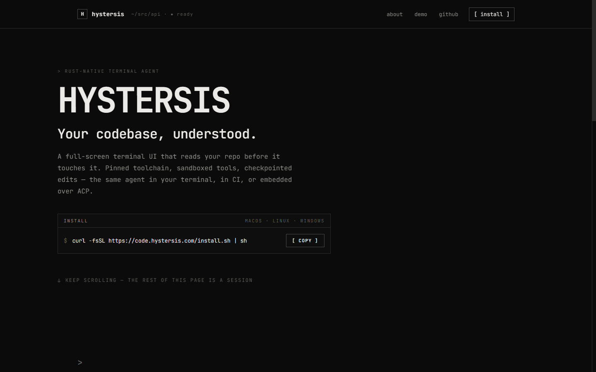
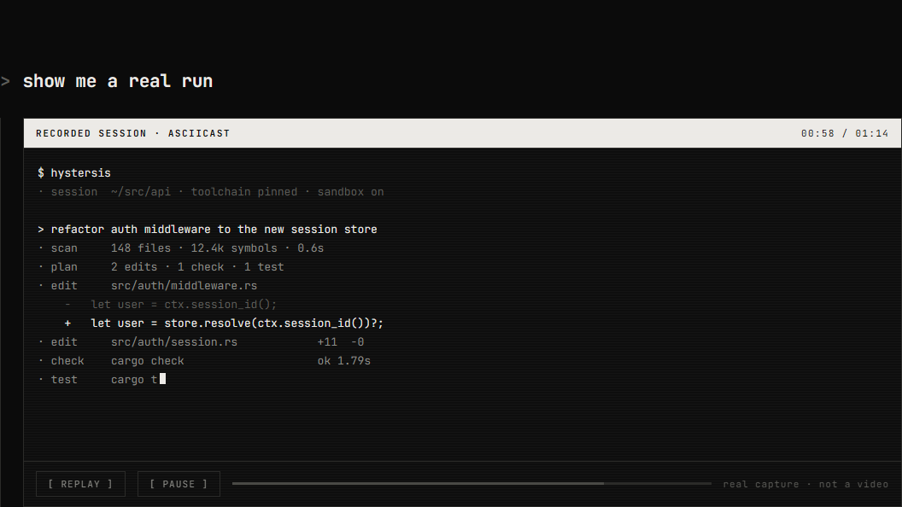

<div align="center">

# Hystersis ASCII Site 

[](#)
[](https://react.dev/)
[](https://vitejs.dev/)



*Pure ASCII. Black & White. Minimalist.*

<br/>

## 🚀 Quick Install

```bash
curl -fsSL https://code.hystersis.com/install.sh | sh
```

<br/>

## 🛠️ Development

Run the local development server:

```bash
npm run dev
```
*(Server will start at localhost:8765)*

<br/>

## 📦 Build

Build the project for production:

```bash
npm run build
```
*(Output will be generated in the `dist/` directory)*

<br/>



<br/>
<br/>

Made with 🖤 for code.hystersis.com

</div>
